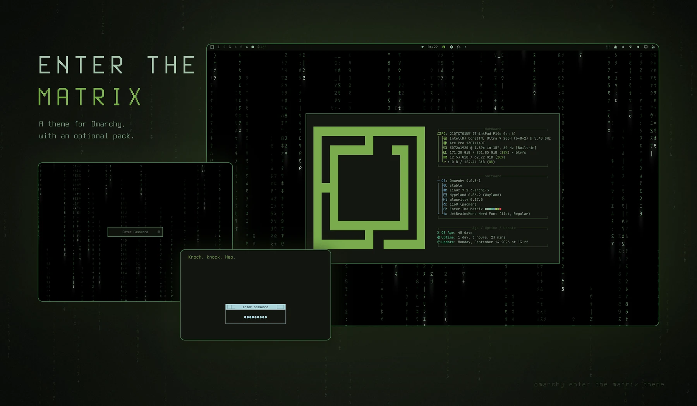
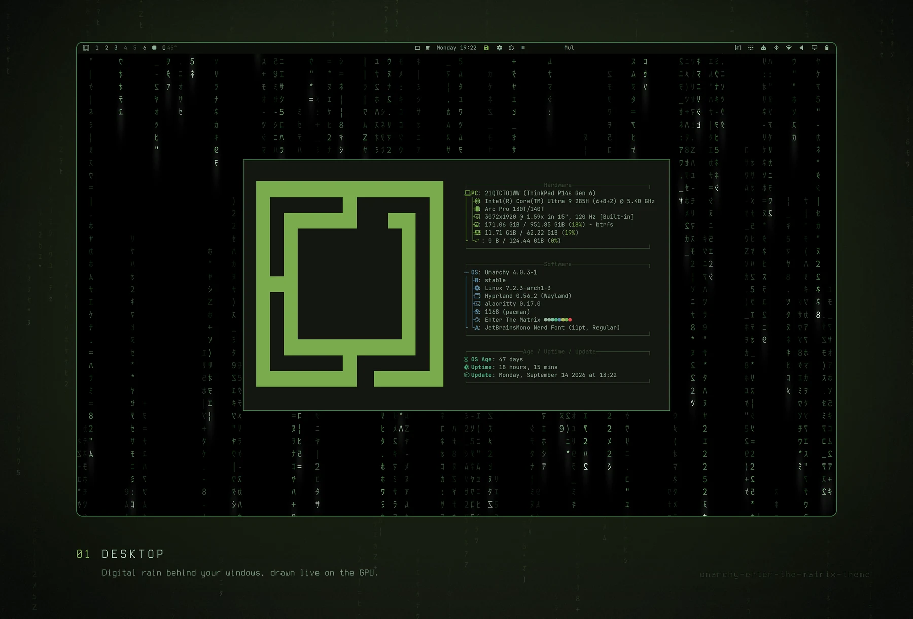
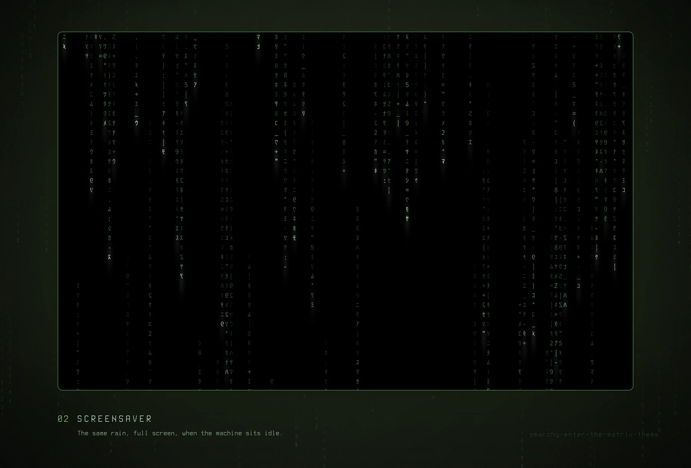
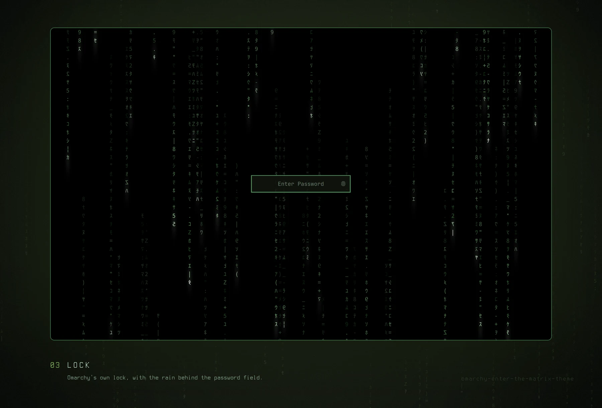
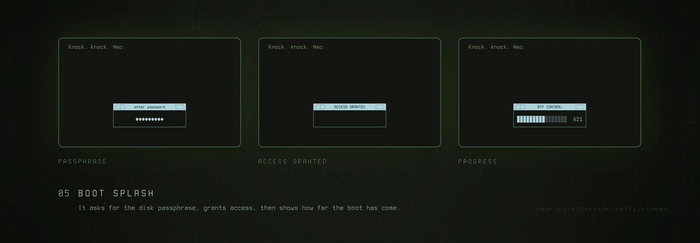
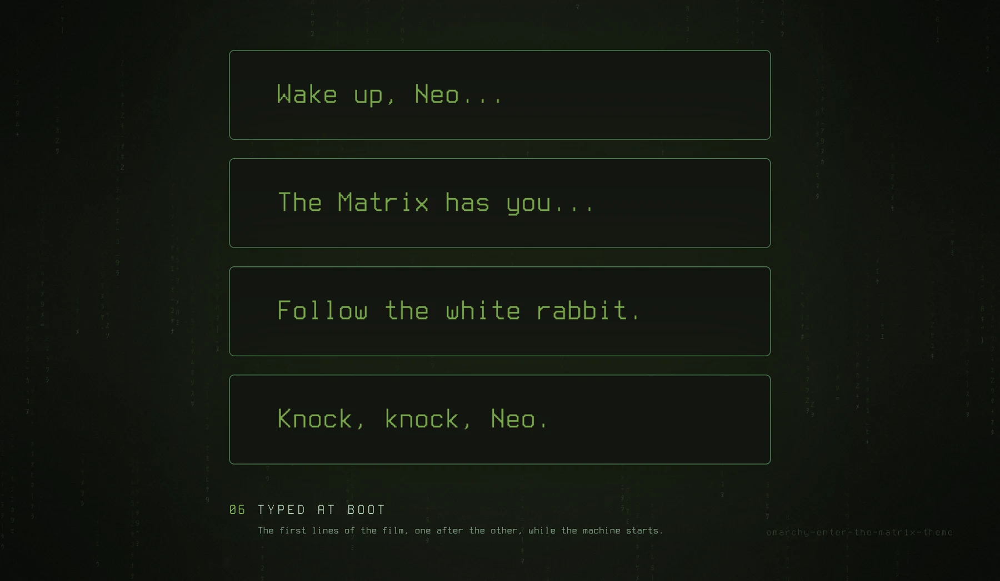
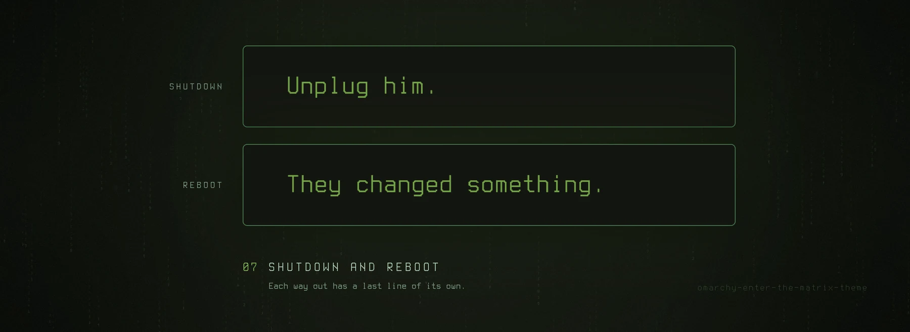

# Enter the Matrix: a theme for Omarchy 4, with an optional pack

Phosphor green on black. The theme is colours and backgrounds, and it works
alone. The pack puts the same digital rain on the desktop, over the screensaver
and behind the lock, plus a boot splash that types out the lines from the film.



## Install

One line: the theme, then the pack on top of it.

```bash
omarchy theme install https://github.com/tymurbogach/omarchy-enter-the-matrix-theme && ~/.config/omarchy/themes/enter-the-matrix/install.sh
```

The pack asks one question:

```
This is your last chance. After this, there is no turning back.
> Red pill    You stay in Wonderland, and I show you how deep the rabbit hole goes.
  Blue pill   The story ends. You wake up in your bed with your simple theme.
```

The red pill is the default: Enter takes it. It installs everything at once,
the rain on the desktop, behind the lock and over the screensaver, and the
boot splash. It restarts the shell once. The boot splash asks for your
password, because it rebuilds the initramfs. The blue pill installs nothing,
and you keep the theme alone.

A theme from git may not run code when Omarchy installs it, so the pack is the
second half of the line. For the theme alone, run only the first half.

`omarchy plugin add <this repo>` is not a way in. The manifest is at the root,
so it looks like it should work, but it installs the whole repository as the
plugin and skips the CLI and the hooks.

## What it looks like

Every picture is a screenshot of the real thing, on Omarchy 4.0.3. Only the
frames and the captions are added, by `tools/generate-showcase.py`.













## Usage

There is nothing to switch. Omarchy's own menus decide, and the rain follows:

| Piece | What decides it |
|---|---|
| Desktop | **Style › Background.** The rain is one background in the list, and any other background stops it. A theme set starts on the rain. On mains it always rains; on battery, only while no window is on the active workspace. |
| Screensaver | **Omarchy.** The rain covers Omarchy's own screensaver whenever Omarchy opens it. Your idle timing, Stay Awake, the key that ends it and the lock that follows it all stay Omarchy's. |
| Lock | **The theme.** Rain behind the password field whenever the theme is on. The lock is derived from your own, never shipped as a copy, so Omarchy's PAM and fingerprint flows keep arriving. |
| Boot | **Style › Unlock.** The Enter the Matrix card types the lines from the film before login, and two more on the way out, different for a shutdown and for a reboot. Any other card boots that theme, with nothing of Matrix left. Either way it is one rebuild of the initramfs, and it asks for your password. |

The command line has five commands:

```bash
omarchy-matrix status       # what is happening right now
omarchy-matrix doctor       # put everything back, for example after 'omarchy refresh shell'
omarchy-matrix update       # pull the latest version, then doctor
omarchy-matrix boot on      # the boot splash, as Style › Unlock sets it
omarchy-matrix uninstall
```

`boot on` records the current screen brightness and applies that percentage in
the initramfs before Plymouth starts. This prevents the brightness step when
the system later restores its desktop setting. If you deliberately change that
setting, run `omarchy-matrix boot on` again before the next reboot.

Try the lock without locking yourself out: `omarchy-shell lock preview`. See the
boot splash without rebooting: `tools/preview-plymouth.sh` from a checkout, and
the shutdown one without shutting down: append `--mode shutdown`.

> **If your disk is encrypted**, Plymouth is also what asks for your passphrase.
> The pack adds a callback rather than editing one, and falls back to Omarchy's
> own dialog rather than to no dialog. If anything goes wrong:
> `omarchy plymouth reset` from a running system, or `plymouth.enable=0` on the
> kernel line from your boot loader.

Worth knowing:

> **Omarchy's screensaver switch decides.** With Stay Awake on, or with
> Omarchy's screensaver switched off (`omarchy toggle screensaver`), no
> screensaver comes up, and no rain either. `omarchy-matrix status` says so.

> **`omarchy refresh shell` turns the rain off.** That command rewrites
> `shell.json` wholesale, and that is where Omarchy records which plugins are
> enabled. There is no hook to attach to afterwards. Recover with
> `omarchy-matrix doctor`. It brings back the rain plugin and the lock, not the
> rest of your `shell.json`: your other plugins and your bar layout come back
> from Omarchy's own backup, `~/.config/omarchy/shell.json.bak.<timestamp>`.

Automatic:

| When | What happens |
|---|---|
| `omarchy theme set enter-the-matrix` | The pack comes back, and Omarchy starts on the rain |
| `omarchy theme set <other>` | The pack stands down |
| `omarchy update` | The lock, the boot splash and the Style › Unlock row are derived again from the updated sources |

Standing down means: the plugin is disabled, Omarchy's screensaver shows
without the rain, and **the lock clone is deleted**, with `omarchy plugin
remove`, which is what re-enables Omarchy's own lock. Merely disabling it would
leave you with no lock enabled at all.

The boot splash is the exception and does not stand down: the Plymouth splash
belongs to the system, not to the theme.

## Remove

`omarchy-matrix uninstall`, or `./uninstall.sh` from the theme directory. It
takes all of it back (the plugin, the lock clone, the CLI, the hooks, the boot
splash and the theme directory itself) and leaves Omarchy's own lock,
screensaver and splash in charge again.

The theme has to go somewhere, and it goes back to **the one you were using
before you picked this one**. The `theme-set` hook writes that down every time you
leave, because Omarchy overwrites `current/theme.name` before any hook runs and
afterwards nobody knows. If you never left the theme, nothing is written down,
and Omarchy's own theme picker asks, the same one as in Style › Theme. If you
pick nothing, you land on Tokyo Night, Omarchy's default.

Pass `--keep-theme` if you want the colours and backgrounds to stay behind as an
ordinary Omarchy theme.

Omarchy's **Remove › Theme** works too. Pick Enter the Matrix there. Once
Omarchy has deleted the theme folder, its terminal opens with the same
uninstall, for the password that the boot splash needs.

From a terminal, `omarchy theme remove enter-the-matrix` deletes only the
folder, and Omarchy tells nobody. The pack notices at your next theme change,
stands down and opens the same terminal.

## Requirements

Omarchy 4.0.3, `jq`, `git`, `python3`, and network for the install and for
updates. The boot splash also needs ImageMagick and `sudo`.

## What it touches on your system

Everything the pack installs is either its own file or a file Omarchy leaves for
extending. **Nothing** under `/usr/share/omarchy/`, nor `hyprland.lua`, nor the
bar:

```
~/.config/omarchy/plugins/io.github.tymurbogach.enter-the-matrix/       the plugin
~/.config/omarchy/backgrounds/enter-the-matrix/0-live-rain.png          a link: the rain, in Style › Background
~/.config/omarchy/hooks/{theme-set,post-update}.d/enter-the-matrix      generated wrappers
~/.config/omarchy/extensions/omarchy-menu.jsonc                         one marked block: Style › Unlock, Remove › Theme
~/.config/omarchy/shell.json                                            Omarchy's list of enabled plugins
~/.local/bin/omarchy-matrix                                             link to the share dir
~/.local/share/omarchy-matrix/                                          the pack itself, and the theme to return to
~/.config/omarchy/plugins/<username>.lock                               only while the theme is on
/usr/share/plymouth/themes/omarchy-matrix/                              only while the Matrix boot splash is on
/etc/initcpio/{hooks,install}/omarchy-matrix-backlight                   only while the Matrix boot splash is on
/etc/mkinitcpio.conf.d/99-omarchy-matrix-backlight.conf                 only while the Matrix boot splash is on
```

The lock and Plymouth theme are derived. The initcpio files are an additive
hook and configuration fragment. Neither overwrites an Omarchy source file.
`omarchy.lock` stays where it was. Plymouth's `omarchy` theme changes only
through Omarchy's own `omarchy plymouth set by theme`, the command that its
Style › Unlock menu runs.

The two menu rows are derived too: the pack builds each one from Omarchy's own
row on every run, and if Omarchy changes a row, Omarchy's original comes back.

"Only while it is on" is meant literally, including the system paths: another
card in Style › Unlock hands the splash back **and** removes them. Nothing is
left behind, whether or not you ever
uninstall.

## The backgrounds

```
00-pills-hands.jpg       the default: what you get with the theme alone
01-morpheus-pills.jpg
02-neo-desk-overhead.jpg
03-morpheus-reflection.jpg
04-hotel-corridor.jpg
05-rain-street.jpg
06-office-crt.jpg
07-trinity-neo.jpg        Trinity and Neo, warm and dark
08-digital-city.jpg
09-matrix-crew.jpg
10-neo-room.jpg
11-falling-code.jpg      green code on black
12-mono-rain.jpg         monochrome rain scene
13-after-hours.jpg       dark green corridor
live/0-live-rain.png     the rain: the pack adds it, first in the list
```

The rain is not in `backgrounds/`, so the theme alone never offers a still of the
one thing that should move. The pack links it into Omarchy's folder for your own
backgrounds of this theme, `~/.config/omarchy/backgrounds/enter-the-matrix/`.
Omarchy lists that folder first, and that is why a theme set starts on the rain.

The rain's name carries `-live-`, and that substring, not a file name or a
position in the list, is what the plugin watches for. Everything else is an
ordinary wallpaper and stays one when you pick it.

> `00-pills-hands.jpg`, `02-neo-desk-overhead.jpg`, `03-morpheus-reflection.jpg`,
> `07-trinity-neo.jpg` and `10-neo-room.jpg` are frames
> from *The Matrix* (1999), © Warner Bros. They are here because this is a
> fan theme and they are what the theme is about. They are not covered by this
> repository's MIT licence, which applies to the code. If you would rather not
> carry them, delete those files and pick your own. Any file with `-live-` in
> its name, in your folder for this theme, becomes the rain's marker.

## The palette

No void black: the film never shows one. Surfaces sit where its dark scenes
actually sit (the pills scene averages `#171716`, Neo's sleep `#0E170C`,
Morpheus in warm ambers), the green is the monitor's own yellow-leaning
phosphor, red is the signal red (pill, dress, alarms) and blue the real
world's steel — each lightened only as far as legibility demands
(`#C8102E` at 3.3:1 cannot carry text). Same green hero, same ice-blue
prompt. The rain is untouched.

## More

- **[DESIGN.md](DESIGN.md)** — why the lock and the boot splash are derived
  rather than copied, what is in each file, the palette, and how to regenerate
  the assets.
- **[CONTRIBUTING.md](CONTRIBUTING.md)** — the workflow, the traps that each
  cost real debugging time, and the clean-room test that decides whether a
  change ships. Read it before changing anything.

## Credits

The rain shader started from [`matrix.frag` in
bjarneo/quickshell](https://github.com/bjarneo/quickshell) (MIT). It swaps the
original's procedural blocks for an atlas of the real halfwidth katakana — the
very ones `ttfx matrix` uses, the effect behind Omarchy's screensaver — and keeps
its colours.

## Licence

MIT.
