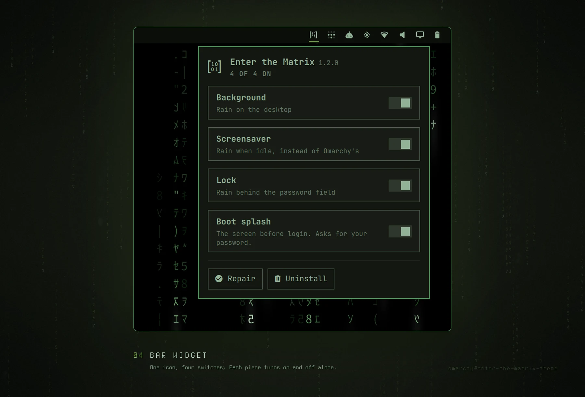

# Enter the Matrix: a theme for Omarchy 4, with an optional pack

Phosphor green on black. The theme is colours and backgrounds, and it works
alone. The pack puts the same digital rain on the desktop, as the screensaver,
and behind the lock — plus a boot splash that types out the lines from the
film.


## Install

The theme, on its own:

```bash
omarchy theme install https://github.com/tymurbogach/omarchy-enter-the-matrix-theme
```

The pack, on top of it (optional):

```bash
~/.config/omarchy/themes/enter-the-matrix/install.sh
```

It asks which pieces you want. Chain the two commands: nothing in Omarchy's
theme installer mentions the second half, so the first line alone leaves you
with a theme and no idea there is more.

That script is the only supported way in. `omarchy plugin add <this repo>` looks
like it should work — the manifest is at the root — but it installs the whole
repository as the plugin and skips the CLI, the hooks and the bar widget, which
is most of the pack.

## What it looks like

Every picture is a screenshot of the real thing, on Omarchy 4.0.3. Only the
frames and the captions are added, by `tools/generate-showcase.py`.





## Usage

Five switches, each one on and off on its own, from the **Matrix icon on your
bar** or from the command line:

```bash
omarchy-matrix status            # what is on right now
omarchy-matrix wallpaper off     # any piece: wallpaper screensaver lock boot widget
omarchy-matrix boot on
omarchy-matrix doctor            # assert everything again
omarchy-matrix update            # pull the latest version, then doctor
```

| Piece | What it is |
|---|---|
| `wallpaper` | Rain on the desktop, above the wallpaper and below every window. Clicks go through it, and Omarchy's own background is not touched. On mains it always rains; on battery, only while no window is on the active workspace. |
| `screensaver` | Rain when you go idle, on your `shell.json` idle timing. It behaves like Omarchy's own: the pointer is hidden, the mouse does not dismiss it, any key does. |
| `lock` | Rain behind the password field. Derived from your own lock, never shipped as a copy, so Omarchy's PAM and fingerprint flows keep arriving. |
| `boot` | The screen before login, typing out the four lines from the film — and two more on the way out, different for a shutdown and for a reboot. Needs your password and rebuilds the initramfs, so it never applies on its own. |
| `widget` | The Matrix icon on the bar: the four switches above with a ✓ each, plus Repair and Uninstall, and Update when a newer version is out. The panel's title carries the version you run. Lives in its own repo, [omarchy-matrix-widget](https://github.com/tymurbogach/omarchy-matrix-widget), fetched automatically by `install.sh`. |

The desktop rain is one more background in the carousel, `1-live-rain`.
`omarchy-matrix wallpaper on` selects it for you.

Try the lock without locking yourself out: `omarchy-shell lock preview`. See the
boot splash without rebooting: `tools/preview-plymouth.sh` from a checkout, and
the shutdown one without shutting down: append `--mode shutdown`.

> **If your disk is encrypted**, Plymouth is also what asks for your passphrase.
> The pack adds a callback rather than editing one, and falls back to Omarchy's
> own dialog rather than to no dialog. If anything goes wrong:
> `omarchy plymouth reset` from a running system, or `plymouth.enable=0` on the
> kernel line from your boot loader.

## Configure

Which pieces are on lives in `~/.config/omarchy/enter-the-matrix.json`, a file
of the pack's own. It is deliberately not in `shell.json`: `omarchy refresh
shell` rewrites that file wholesale and would take the settings with it.

Worth knowing:

> **`omarchy theme set` rotates to the *next* background**, so re-applying the
> theme takes you off the rain. Come back with `omarchy-matrix wallpaper on`, or
> from the bar.

> **With "stay awake" on, the screensaver never comes up.** The pack respects the
> same switch Omarchy's idle service does: with it set there is no
> screensaver, neither ours nor theirs.

> **Careful with Omarchy's own toggle.** The `screensaver` piece uses the native
> `screensaver-off` flag, so `omarchy toggle screensaver` turns it off underneath
> while the settings file still says yes. `omarchy-matrix doctor` puts them back
> in agreement.

> **`omarchy refresh shell` turns the rain off.** That command rewrites
> `shell.json` wholesale, and that is where Omarchy records which plugins are
> enabled and what sits on your bar. There is no hook to attach to afterwards.
> Recover with `omarchy-matrix doctor`. It brings back the rain plugin, the lock
> clone and the bar icon — not the rest of your `shell.json`; your other plugins
> and your bar layout come back from Omarchy's own backup,
> `~/.config/omarchy/shell.json.bak.<timestamp>`.

Automatic:

| When | What happens |
|---|---|
| `omarchy theme set enter-the-matrix` | Whatever you had on comes back |
| `omarchy theme set <other>` | The pack stands down, keeping your settings |
| `omarchy update` | The lock and the boot splash are derived again from the updated sources |

Standing down means: the plugin is disabled, the bar icon goes, Omarchy's
screensaver returns, and **the lock clone is deleted** — with
`omarchy plugin remove`, which is what re-enables Omarchy's own; merely disabling
it would leave you with no lock enabled at all. Your settings are untouched:
going back restores exactly what you had.

`boot` is the exception and does not stand down: the Plymouth splash belongs to
the system, not to the theme.

While the pack is stood down the widget **ticks nothing** and
`omarchy-matrix status` says why. The ✓ means "this is happening now", not "you
have it configured". If a piece is on in your settings but has no ✓, the
widget's panel and `status` both give the reason.

## Remove

**Uninstall**, at the bottom of the bar widget's panel, or
`omarchy-matrix uninstall`, or `./uninstall.sh` from the theme directory. It
takes all of it back — both plugins, the lock clone, the CLI, the hooks, the boot
splash and the theme directory itself — and leaves Omarchy's own lock,
screensaver and splash in charge again.

The theme has to go somewhere, and it goes back to **the one you were using
before you picked this one**. The `theme-set` hook writes that down every time you
leave, because Omarchy overwrites `current/theme.name` before any hook runs and
afterwards nobody knows. If there is nothing recorded, it asks.

Pass `--keep-theme` if you want the colours and backgrounds to stay behind as an
ordinary Omarchy theme.

> **Do not use Omarchy's `Remove → Theme` on its own.** That command deletes the
> theme folder and nothing else, which would leave the plugin, the lock clone,
> the CLI and the hooks installed and pointing at a theme that is gone.
> Uninstall first, remove the theme after. If you already did it the other way
> round, the share copy at `~/.local/share/omarchy-matrix/uninstall.sh` still
> undoes the pack.

## Requirements

Omarchy 4.0.3, `jq`, `git`, `python3`, and network for the first install (the
widget is fetched once, then pinned) and for updates. The boot splash additionally needs
ImageMagick and `sudo`, and only when you ask for it.

## What it touches on your system

Everything the pack installs is either its own file or a file Omarchy leaves for
extending. **Nothing** under `/usr/share/omarchy/`, nor `hyprland.lua`, nor the
background, nor the bar:

```
~/.config/omarchy/plugins/io.github.tymurbogach.enter-the-matrix/         the plugin
~/.config/omarchy/plugins/io.github.tymurbogach.enter-the-matrix.widget/  the bar widget
~/.config/omarchy/enter-the-matrix.json                                   which pieces are on
~/.config/omarchy/hooks/{theme-set,post-update}.d/enter-the-matrix        generated wrappers
~/.config/omarchy/shell.json                                              one entry in the bar layout
~/.local/bin/omarchy-matrix                                               link to the share dir
~/.local/share/omarchy-matrix/{bin,lib,provider.json,uninstall.sh}        the pack itself
~/.cache/omarchy-matrix/update.json                                       the last update check
~/.config/omarchy/plugins/<username>.lock                                 only while `lock` is on
/usr/share/plymouth/themes/omarchy-matrix/                                only while `boot` is on
```

The last two are the derived pieces, and neither overwrites the original:
`omarchy.lock` and Plymouth's `omarchy` theme stay where they were.

"Only while it is on" is meant literally, including for the one path outside your
home directory: `omarchy-matrix boot off` hands the splash back **and** removes
that directory. Turning a piece off leaves nothing behind, whether or not you
ever uninstall.

## The backgrounds

```
0-pills.jpg        the default: what you get with the theme alone
1-live-rain.png    the live one — selecting it turns the desktop rain on
2-neo-sleep.jpg
3-morpheus.jpg
4-sunglasses.jpg
5-hotel-corridor.jpg
6-green-street.jpg
7-the-office.jpg
8-helicopter.png   daylight raid, pale green sky
9-neo-white.jpg    Neo on white — the bright one, for when the rain is off
10-trinity-neo.jpg  Trinity and Neo, warm and dark
```

The rain has an entry of its own, and it is the only one with `-live-` in its
name: that substring, not a fixed filename or a position in the list, is what the
shader watches for. Everything else is an ordinary wallpaper and stays one when
you pick it.

The default is a photograph rather than the rain frame, so installing the theme
without the pack leaves you with a wallpaper instead of a frozen picture of the
one thing the theme is about making move.

> `0-pills.jpg`, `2-neo-sleep.jpg`, `3-morpheus.jpg`, `4-sunglasses.jpg`,
> `8-helicopter.png`, `9-neo-white.jpg` and `10-trinity-neo.jpg` are frames
> from *The Matrix* (1999), © Warner Bros. They are here because this is a
> fan theme and they are what the theme is about. They are not covered by this
> repository's MIT licence, which applies to the code. If you would rather not
> carry them, delete those seven and pick your own — any file with `-live-` in its
> name becomes the rain's marker.

## The palette

No void black: the film never shows one. Surfaces sit where its dark scenes
actually sit (the pills scene averages `#171716`, Neo's sleep `#0E170C`,
Morpheus in warm ambers), the green is the monitor's own yellow-leaning
phosphor, red is the signal red (pill, dress, alarms) and blue the real
world's steel — each lightened only as far as legibility demands
(`#C8102E` at 3.3:1 cannot carry text). Same green hero, same ice-blue
prompt. The rain is untouched.

## More

- **[DESIGN.md](DESIGN.md)** — why the lock and the boot splash are derived
  rather than copied, what is in each file, the palette, and how to regenerate
  the assets.
- **[CONTRIBUTING.md](CONTRIBUTING.md)** — the workflow, the traps that each
  cost real debugging time, and the clean-room test that decides whether a
  change ships. Read it before changing anything.

## Credits

The rain shader started from [`matrix.frag` in
bjarneo/quickshell](https://github.com/bjarneo/quickshell) (MIT). It swaps the
original's procedural blocks for an atlas of the real halfwidth katakana — the
very ones `ttfx matrix` uses, the effect behind Omarchy's screensaver — and keeps
its colours.

## Licence

MIT.
